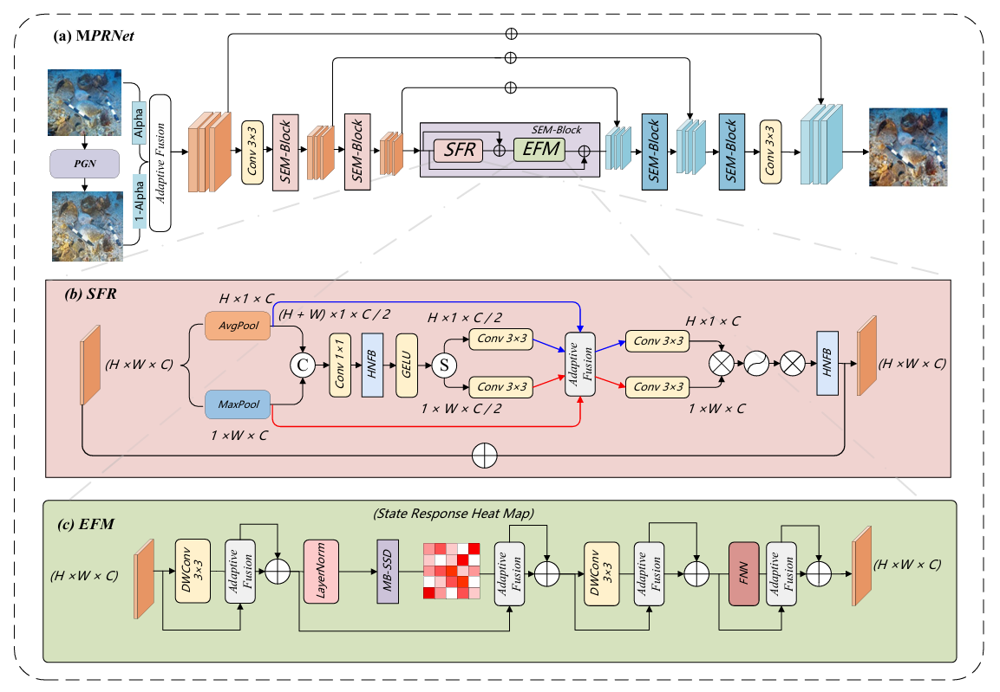

# MPRNet




## Requirements

- Python 3.10 (recommended)
- PyTorch 2.4.1 + CUDA 11.8 (recommended)
- Additional packages listed in `requirements.txt`

## Dataset
The partitioning of our dataset is shown in the README file under UnderWaterDataset
You can obtain it through [datasets](https://pan.quark.cn/s/dc72523f93d2)

## model_files
You can obtain it through [model_files](https://pan.quark.cn/s/0dadfea6ba6f)

## ours train model
If you want to quickly test the effectiveness, you can obtain the results of our training here [ours_pth](https://pan.quark.cn/s/e9d1f89c6c1f)

## Train

Training from scratch is efficient as our light-weight design.
```
python train.py \
  --dataset [dataset] \
  --epoch 100 \
  --model_name MPRNet
```
## Evaluation

There is a reference dataset available

```aiignore
python test.py \
  --dataset [dataset] \
  --ckpt [checkpoint.pth] \
```

No reference dataset
```aiignore
python test_nr.py \
  --dataset [dataset] \
  --ckpt [checkpoint.pth] \
```
